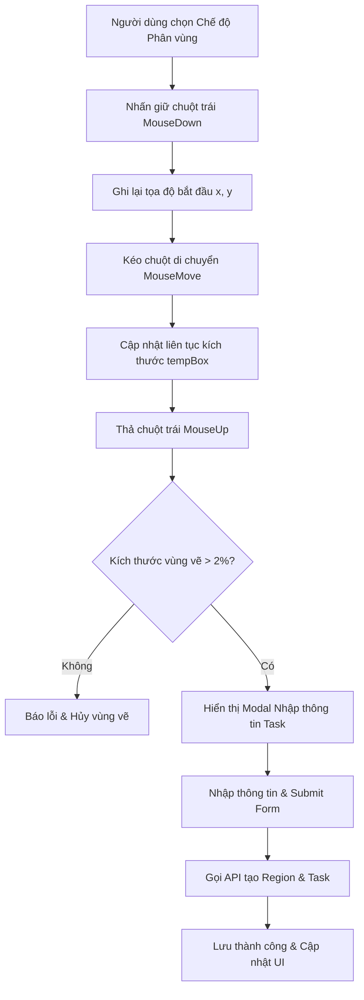

# Phân Tích & Hướng Dẫn Triển Khai: Vẽ Vùng Kéo Thả Bằng Chuột Trái Để Giao Task

Tài liệu này phân tích chi tiết cơ chế hoạt động hiện tại và hướng dẫn các bước triển khai/cải tiến tính năng kéo thả chuột trái trên bản thảo (Manga Draft Image) để vẽ một vùng làm việc (Region) và kích hoạt khung nhập thông tin nhiệm vụ (Task Modal) giao cho trợ lý.

---

## 1. Cơ Chế Hoạt Động & Luồng Dữ Liệu (Workflow)



### Các trạng thái (State) quản lý:
- `mode`: Chế độ hiện tại (`"draw_region"` để kích hoạt vẽ).
- `isDrawing`: Biến boolean để biết chuột có đang được nhấn giữ hay không.
- `drawStart`: Lưu tọa độ bắt đầu `{ x, y }` khi click chuột xuống.
- `tempBox`: Lưu thông số vùng vẽ tạm thời `{ x, y, width, height }` theo phần trăm `%`.
- `showTaskModal`: Trạng thái hiển thị modal giao task.

---

## 2. Chi Tiết Các Bước Triển Khai Trong Mã Nguồn

Các logic này được đặt tại file component [PageWorkspacePage.jsx](file:///d:/thang/Project_CNPM/frontend/src/pages/PageWorkspacePage/PageWorkspacePage.jsx).

### Bước 2.1: Bắt sự kiện MouseDown (Bắt đầu vẽ)
Khi người dùng nhấn chuột trái xuống ảnh bản thảo:
- Lấy bounding client rect của ảnh để xác định vị trí thực tế.
- Tính toán tọa độ của chuột đối với lề trên và lề trái của ảnh.
- Gán `isDrawing = true` và khởi tạo `tempBox`.

```javascript
const handleMouseDown = (e) => {
  if (mode !== "draw_region") return;
  e.preventDefault();
  const rect = imageRef.current.getBoundingClientRect();
  const startX = e.clientX - rect.left;
  const startY = e.clientY - rect.top;
  
  setIsDrawing(true);
  setDrawStart({ x: startX, y: startY });
  setTempBox({
    x: (startX / rect.width) * 100,
    y: (startY / rect.height) * 100,
    width: 0,
    height: 0
  });
};
```

### Bước 2.2: Bắt sự kiện MouseMove (Kéo chuột vẽ khung)
Khi di chuyển chuột trên màn hình:
- Tính toán góc trên bên trái của khung vẽ và cập nhật kích thước theo phần trăm `%`.

```javascript
const handleMouseMove = (e) => {
  if (!isDrawing || mode !== "draw_region") return;
  const rect = imageRef.current.getBoundingClientRect();
  const currentX = e.clientX - rect.left;
  const currentY = e.clientY - rect.top;
  
  const x = Math.min(drawStart.x, currentX);
  const y = Math.min(drawStart.y, currentY);
  const width = Math.abs(drawStart.x - currentX);
  const height = Math.abs(drawStart.y - currentY);
  
  setTempBox({
    x: (x / rect.width) * 100,
    y: (y / rect.height) * 100,
    width: (width / rect.width) * 100,
    height: (height / rect.height) * 100
  });
};
```

### Bước 2.3: Bắt sự kiện MouseUp (Thả chuột và Mở khung nhập)
Khi thả chuột ra, kiểm tra kích thước và gán `showTaskModal(true)`.

```javascript
const handleMouseUp = () => {
  if (!isDrawing) return;
  setIsDrawing(false);
  if (tempBox && (tempBox.width > 2 || tempBox.height > 2)) {
    setShowTaskModal(true);
  } else {
    setTempBox(null);
    toast.error("Vùng vẽ quá nhỏ, vui lòng kéo lại!");
  }
};
```

---

## 3. Form Giao Nhiệm Vụ & Lưu Dữ Liệu
Khi gửi thông tin, hệ thống gọi API tạo Region trước rồi tạo Task liên kết.

---

## 4. Các Lưu Ý Khi Phát Triển & Sửa Lỗi (Best Practices)
1. **Responsive Image**: Dùng đơn vị `%` để khung hiển thị đúng ở mọi màn hình.
2. **Draggable False**: `draggable={false}` trên thẻ ảnh bản thảo để tránh xung đột sự kiện kéo thả HTML5.
3. **Cơ chế Rollback**: Xóa Region nếu chỉ định Task bị lỗi.

---

## 5. Những Ghi Chú Thay Đổi Gần Đây (Cập Nhật UI Theo Yêu Cầu)

Chúng tôi đã thực hiện cập nhật giao diện trực tiếp tại [PageWorkspacePage.jsx](file:///d:/thang/Project_CNPM/frontend/src/pages/PageWorkspacePage/PageWorkspacePage.jsx) để giao diện trực quan và gọn gàng hơn:

### 1. Đổi tên nút Chế độ Phân vùng:
- **Trước thay đổi**: Nút hiển thị chữ `"Phân vùng (Mangaka)"`.
- **Sau thay đổi**: Đã chuyển tên nhãn hiển thị thành **`"Giao nhiệm vụ"`** để phù hợp hơn với thao tác thực tế của người dùng.
- **Vị trí file code**: [PageWorkspacePage.jsx](file:///d:/thang/Project_CNPM/frontend/src/pages/PageWorkspacePage/PageWorkspacePage.jsx#L408-L415).

### 2. Xóa bỏ thanh thông báo hướng dẫn màu vàng:
- **Trước thay đổi**: Khi chọn chế độ vẽ vùng, trên đỉnh ảnh bản thảo hiển thị một thanh hướng dẫn màu vàng (`📐 Kéo giữ chuột trên ảnh để vẽ vùng và giao việc trợ lý.`).
- **Sau thay đổi**: Khối banner màu vàng này đã **được loại bỏ hoàn toàn** khỏi giao diện.
- **Vị trí file code**: Bị xóa ở khoảng dòng 425-430.

### 3. Xóa bỏ thanh hướng dẫn màu cam (Góp ý biên tập):
- **Trước thay đổi**: Khi ở chế độ góp ý biên tập, trên đỉnh ảnh bản thảo hiển thị một thanh màu cam (`📌 Nhấp vào vị trí trên ảnh để cắm ghim góp ý biên tập.`).
- **Sau thay đổi**: Khối banner màu cam này đã **được loại bỏ hoàn toàn** khỏi giao diện.
- **Vị trí file code**: Bị xóa ở khoảng dòng 424-428.

### 4. Thay đổi tiêu đề, nhãn và nút trong Bảng giao nhiệm vụ:
- **Tiêu đề bảng (Modal Title)**: Đã chuyển từ `"Phân chia vùng & giao Task trợ lý"` thành **`"Giao nhiệm vụ"`**.
- **Nhãn trường (Label)**: Đã chuyển từ `"Loại phân vùng vẽ:"` thành **`"Hạng mục vẽ:"`**.
- **Nút gửi (Submit Button)**: Đã chuyển từ `"Giao việc & Vẽ Vùng 🚀"` thành **`"Giao việc 🚀"`**.
- **Vị trí file code**: Trong cấu trúc Modal ở các dòng từ 910 đến 980.

---

## 6. Giải Thích Lỗi: "Thiếu thông tin bắt buộc (page_id, coordinates, region_type)"

### Nguyên nhân xảy ra lỗi:
1. **Phía Frontend**: Khi gọi hàm `createRegion(pageId, regionData)`, client gửi request `POST /api/regions/page/:page_id` với tham số `pageId` nằm trên URL (route parameter). Trong thân hàm request (body) chỉ gửi `{ coordinates, region_type }`.
2. **Phía Backend**: Ở file controller cũ [regionController.js](file:///d:/thang/Project_CNPM/backend/src/controllers/region/regionController.js), backend bóc tách dữ liệu từ body của request:
   ```javascript
   const { page_id, coordinates, region_type } = req.body;
   ```
   Do frontend không gửi `page_id` trong body (vì đã truyền trên URL) nên `req.body.page_id` bị `undefined`. Điều này khiến điều kiện kiểm tra bắt buộc bị vi phạm và trả về lỗi `400 Bad Request`.

### Cách khắc phục:
Chúng tôi đã chỉnh sửa file controller [regionController.js](file:///d:/thang/Project_CNPM/backend/src/controllers/region/regionController.js) tại Backend để linh hoạt lấy `page_id` từ body hoặc tự động fallback (dự phòng) lấy từ tham số URL (`req.params.page_id`):
```javascript
const page_id = req.body.page_id || req.params.page_id;
const { coordinates, region_type } = req.body;
```
Giải pháp này vừa sửa dứt điểm lỗi trên giao diện thực tế của người dùng, vừa đảm bảo tương thích 100% với các bộ Unit Test hiện có của backend (vốn truyền `page_id` trực tiếp trong body).

---

## 7. Giải Thích & Sửa Lỗi: "Tràn viền" và "Mất góp ý" ở thanh Sidebar

### Nguyên nhân xảy ra lỗi:
1. **Lỗi Tràn Viền (Overflow)**: Khung Sidebar `.ws-sidebar` có giới hạn chiều cao `max-height: 100%` để vừa vặn chiều cao màn hình. Tuy nhiên, nó thiếu thuộc tính `overflow-y: auto`. Khi danh sách nhiệm vụ trợ lý hoặc vùng chi tiết mở rộng quá dài, các thẻ con sẽ bị vẽ lòi ra bên ngoài viền khung đen của Sidebar (tràn viền).
2. **Lỗi Mất Góp Ý**: Container hiển thị góp ý được thiết lập class `flex-1 overflow-y-auto`. Khi vùng chi tiết và vùng nhiệm vụ trợ lý chiếm dụng hết không gian trống của Sidebar, flexbox sẽ ép chiều cao của vùng góp ý này co lại về `0px`, khiến nó hoàn toàn bị ẩn đi trên giao diện mặc dù dữ liệu vẫn tồn tại.

### Cách khắc phục:
Chúng tôi đã điều chỉnh đồng bộ giữa JSX và CSS như sau:
1. **Tại file CSS** [PageWorkspacePage.css](file:///d:/thang/Project_CNPM/frontend/src/pages/PageWorkspacePage/PageWorkspacePage.css):
   - Thêm thuộc tính `overflow-y: auto` vào lớp `.ws-sidebar` để toàn bộ Sidebar có khả năng tự cuộn khi nội dung vượt quá chiều cao màn hình.
   - Thêm quy tắc ẩn thanh cuộn trình duyệt (`-ms-overflow-style: none`, `scrollbar-width: none` và `::-webkit-scrollbar { display: none; }`) để đảm bảo thẩm mỹ thiết kế Brutalism.
2. **Tại file JSX** [PageWorkspacePage.jsx](file:///d:/thang/Project_CNPM/frontend/src/pages/PageWorkspacePage/PageWorkspacePage.jsx):
   - Loại bỏ các class giới hạn `flex-1 overflow-y-auto` cùng các lệnh ẩn thanh cuộn cụ bộ khỏi container danh sách Góp ý. Cho phép vùng Góp ý tự động co giãn theo kích thước tự nhiên để hiển thị đầy đủ tiêu đề và nội dung, nhường việc cuộn lại cho scrollbar tổng của Sidebar.

---

## 8. Cập Nhật Trang Quản Lý Task Trợ Lý: Hủy Nhiệm Vụ & Cân Đối Giao Diện

Chúng tôi đã thực hiện cập nhật quy trình và giao diện theo yêu cầu mới tại trang `/mangaka/tasks`:

### 1. Thêm tính năng Hủy nhiệm vụ đã giao:
- **Backend**:
  - Tạo hàm controller `deleteTask` tại [taskController.js](file:///d:/thang/Project_CNPM/backend/src/controllers/task/taskController.js) để xử lý việc hủy task. Hàm này sẽ xóa tài liệu Task khỏi DB, đồng thời tự động xóa vùng bản vẽ tương ứng (`PageRegion`) để giải phóng bản thảo.
  - Đăng ký route `DELETE /api/tasks/:id` yêu cầu quyền Mangaka/Admin tại [task.routes.js](file:///d:/thang/Project_CNPM/backend/src/routes/task.routes.js).
- **Frontend**:
  - Viết service gọi API `deleteTaskApi` tại [taskService.js](file:///d:/thang/Project_CNPM/frontend/src/services/task/taskService.js).
  - Tích hợp nút **`"Hủy nhiệm vụ 🗑️"`** màu đỏ Brutalism tại panel chi tiết bên phải của [MangakaTasksPage.jsx](file:///d:/thang/Project_CNPM/frontend/src/pages/MangakaTasksPage/MangakaTasksPage.jsx). Nút này chỉ xuất hiện khi nhiệm vụ chưa được `Approved` (Đã duyệt) hoặc `Paid` (Đã thanh toán).

### 2. Xóa mục "Tạo & Phân công Task mới":
- Đã loại bỏ hoàn toàn thanh chọn Tab menu (`mtp-tabs`), nút `"Tạo & Phân công Task mới"`, cùng toàn bộ form phân công việc cũ khỏi mã nguồn của [MangakaTasksPage.jsx](file:///d:/thang/Project_CNPM/frontend/src/pages/MangakaTasksPage/MangakaTasksPage.jsx).
- Việc phân công vẽ vùng và giao task nay được tích hợp trực tiếp, trực quan hơn qua thao tác vẽ/kéo thả chuột tại trang Workspace của trang truyện (`PageWorkspacePage`), giúp đồng bộ tọa độ chính xác.

### 3. Cân đối giao diện:
- Cấu hình lại hệ lưới và căn lề cho [MangakaTasksPage.css](file:///d:/thang/Project_CNPM/frontend/src/pages/MangakaTasksPage/MangakaTasksPage.css) để trang chỉ tập trung vào danh sách công việc đã giao ở bên trái (MD: col-span-5) và khung nghiệm thu / so sánh Before-After / Hủy nhiệm vụ ở bên phải (MD: col-span-7), giúp bố cục cân đối, gọn gàng và dễ nhìn.

---

## 9. Cập Nhật Giao Diện: Thêm Chức Năng Hủy Chương Truyện

Chúng tôi đã tích hợp tính năng Hủy chương (Xóa chương) tại trang quản lý danh sách Chapter:

### 1. Backend:
- Tạo hàm controller `deleteChapter` tại [deleteChapter.js](file:///d:/thang/Project_CNPM/backend/src/controllers/chapter/deleteChapter.js) để xử lý việc hủy chương. Hàm này thực hiện:
  - Kiểm tra điều kiện: Chỉ cho phép hủy chương ở trạng thái **Bản nháp (Draft)**.
  - Tự động xóa dọn dẹp (cascade delete) tất cả các dữ liệu con liên đới gồm: Trang bản thảo (`Page`), phân vùng vẽ (`PageRegion`), góp ý biên tập (`Annotation`), và task công việc trợ lý (`Task`) để giữ cho MongoDB sạch sẽ.
- Đăng ký route `DELETE /api/chapters/:chapter_id` yêu cầu quyền Mangaka/Admin tại [chapter.routes.js](file:///d:/thang/Project_CNPM/backend/src/routes/chapter.routes.js).

### 2. Frontend:
- Tạo service gọi API `deleteChapter` tại [deleteChapterService.js](file:///d:/thang/Project_CNPM/frontend/src/services/chapter/deleteChapterService.js).
- Bổ sung callback hủy chương `handleDeleteChapter` tại [ChapterListPage.jsx](file:///d:/thang/Project_CNPM/frontend/src/pages/ChapterListPage/ChapterListPage.jsx) và truyền xuống cho bảng.
- Hiển thị nút **`"Hủy chương 🗑️"`** màu đỏ Brutalism tại cột làm việc của từng hàng trong [ChapterTable.jsx](file:///d:/thang/Project_CNPM/frontend/src/components/chapter/ChapterTable/ChapterTable.jsx). Nút chỉ xuất hiện cho các chapter ở trạng thái Bản nháp.
- Định nghĩa style đồng bộ cho nút tại [ChapterTable.css](file:///d:/thang/Project_CNPM/frontend/src/components/chapter/ChapterTable/ChapterTable.css).

---

## 10. Cập Nhật Giao Diện: Thêm Chức Năng Xóa Bản Thảo Trong Mục Giao Task

Chúng tôi đã triển khai tính năng Xóa bản thảo (Xóa trang truyện ở trạng thái nháp) tại trang quản lý bản thảo (`/page-management/:chapterId`):

### 1. Backend:
- Tạo hàm controller `deletePage` tại [deletePage.js](file:///d:/thang/Project_CNPM/backend/src/controllers/page/deletePage.js) để xử lý việc xóa trang. Hàm này thực hiện:
  - Kiểm tra điều kiện: Chỉ cho phép xóa trang truyện ở trạng thái **Bản nháp (Draft)**.
  - Tự động xóa dọn dẹp (cascade delete) tất cả các dữ liệu liên quan của trang gồm: Phân vùng vẽ (`PageRegion`), góp ý biên tập (`Annotation`), và task công việc trợ lý (`Task`) để giữ cho DB sạch sẽ.
- Đăng ký route `DELETE /api/pages/:page_id` tại [page.routes.js](file:///d:/thang/Project_CNPM/backend/src/routes/page.routes.js).

### 2. Frontend:
- Tạo service gọi API `deletePage` tại [deletePageService.js](file:///d:/thang/Project_CNPM/frontend/src/services/page/deletePageService.js).
- Tích hợp hàm callback `handleDeletePage` tại [PageManagementPage.jsx](file:///d:/thang/Project_CNPM/frontend/src/pages/PageManagementPage/PageManagementPage.jsx) và truyền xuống qua `PageGallery`.
- Nhận và truyền tiếp callback tại [PageGallery.jsx](file:///d:/thang/Project_CNPM/frontend/src/components/page/PageGallery/PageGallery.jsx).
- Hiển thị nút **`"Xóa bản thảo 🗑️"`** màu đỏ Brutalism ngay bên dưới nút "Gửi Kiểm duyệt" trong [PageItemCard.jsx](file:///d:/thang/Project_CNPM/frontend/src/components/page/PageItemCard/PageItemCard.jsx). Nút chỉ xuất hiện cho các trang ở trạng thái Bản nháp.
- Định nghĩa style cho nút tại [PageItemCard.css](file:///d:/thang/Project_CNPM/frontend/src/components/page/PageItemCard/PageItemCard.css).

---

## 11. Sửa Lỗi: Bị Load 2 Lần Khi Vừa Giao Nhiệm Vụ Xong Ở Workspace

### Nguyên nhân xảy ra lỗi:
1. **Thay đổi dependency trong `useEffect`**: Trước kia `useEffect` gọi `fetchAllData()` có dependency là `[fetchAllData]`. Khi giao nhiệm vụ xong, các hàm `setRegions` và `setTasks` thay đổi trạng thái component, làm thay đổi tham chiếu của hàm `fetchAllData`, kích hoạt `useEffect` chạy thêm một lần nữa (tổng cộng load 2 lần).
2. **Thiếu đồng bộ thông tin đầy đủ**: Sau khi tạo Task thành công, client chỉ thực hiện đẩy thô thông tin `newTask` (chứa ObjectId) trực tiếp vào state:
   ```javascript
   setTasks((prev) => [...prev, taskRes.task]);
   ```
   Do thông tin trợ lý (`assigned_to`) trả về lúc này chỉ là một ID string chứ chưa được populate thành object `{ _id, name, email }`, UI hiển thị tên trợ lý là `"Chưa rõ"`. Muốn xem được tên đầy đủ bắt buộc phải fetch lại dữ liệu từ server.

### Cách khắc phục:
Chúng tôi đã chỉnh sửa logic tại file [PageWorkspacePage.jsx](file:///d:/thang/Project_CNPM/frontend/src/pages/PageWorkspacePage/PageWorkspacePage.jsx) như sau:
1. **Khóa dependency của `useEffect`**: Đổi dependency của `useEffect` từ `[fetchAllData]` thành `[pageId]`. Điều này đảm bảo dữ liệu chỉ được tải từ API một lần duy nhất khi component mount hoặc khi chuyển đổi trang truyện, ngăn chặn hoàn toàn việc tự động kích hoạt tải lại do thay đổi hàm tham chiếu.
2. **Đồng bộ thông tin bằng cách Fetch chủ động**: Thay thế lệnh push dữ liệu thủ công bằng cách gọi trực tiếp `await fetchAllData()` ngay sau khi tạo Task thành công trong hàm `handleCreateTaskAndRegion`. Thao tác này giúp tải lại thông tin đã được populate đầy đủ từ Backend (bao gồm tên trợ lý hiển thị đúng là `"System Assistant"`), kết hợp đồng bộ trong cùng một lần xoay vòng trạng thái `isLoading` (chỉ load duy nhất 1 lần).


