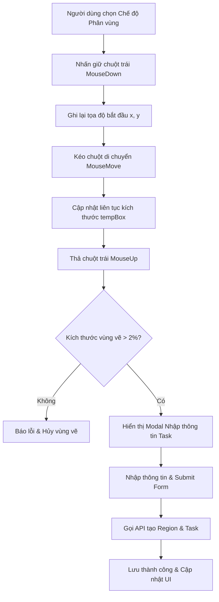

# Phân Tích & Hướng Dẫn Triển Khai: Vẽ Vùng Kéo Thả Bằng Chuột Trái Để Giao Task

Tài liệu này phân tích chi tiết cơ chế hoạt động hiện tại và hướng dẫn các bước triển khai/cải tiến tính năng kéo thả chuột trái trên bản thảo (Manga Draft Image) để vẽ một vùng làm việc (Region) và kích hoạt khung nhập thông tin nhiệm vụ (Task Modal) giao cho trợ lý.

---

## 1. Cơ Chế Hoạt Động & Luồng Dữ Liệu (Workflow)



### Các trạng thái (State) quản lý:
- `mode`: Chế độ hiện tại (`"draw_region"` để kích hoạt vẽ).
- `isDrawing`: Biến boolean để biết chuột có đang được nhấn giữ hay không.
- `drawStart`: Lưu tọa độ bắt đầu `{ x, y }` khi click chuột xuống.
- `tempBox`: Lưu thông số vùng vẽ tạm thời `{ x, y, width, height }` theo phần trăm `%`.
- `showTaskModal`: Trạng thái hiển thị modal giao task.

---

## 2. Chi Tiết Các Bước Triển Khai Trong Mã Nguồn

Các logic này được đặt tại file component [PageWorkspacePage.jsx](file:///d:/thang/Project_CNPM/frontend/src/pages/PageWorkspacePage/PageWorkspacePage.jsx).

### Bước 2.1: Bắt sự kiện MouseDown (Bắt đầu vẽ)
Khi người dùng nhấn chuột trái xuống ảnh bản thảo:
- Lấy bounding client rect của ảnh để xác định vị trí thực tế.
- Tính toán tọa độ của chuột đối với lề trên và lề trái của ảnh.
- Gán `isDrawing = true` và khởi tạo `tempBox`.

```javascript
const handleMouseDown = (e) => {
  if (mode !== "draw_region") return;
  e.preventDefault();
  const rect = imageRef.current.getBoundingClientRect();
  const startX = e.clientX - rect.left;
  const startY = e.clientY - rect.top;
  
  setIsDrawing(true);
  setDrawStart({ x: startX, y: startY });
  setTempBox({
    x: (startX / rect.width) * 100,
    y: (startY / rect.height) * 100,
    width: 0,
    height: 0
  });
};
```

### Bước 2.2: Bắt sự kiện MouseMove (Kéo chuột vẽ khung)
Khi di chuyển chuột trên màn hình:
- Tính toán góc trên bên trái của khung vẽ và cập nhật kích thước theo phần trăm `%`.

```javascript
const handleMouseMove = (e) => {
  if (!isDrawing || mode !== "draw_region") return;
  const rect = imageRef.current.getBoundingClientRect();
  const currentX = e.clientX - rect.left;
  const currentY = e.clientY - rect.top;
  
  const x = Math.min(drawStart.x, currentX);
  const y = Math.min(drawStart.y, currentY);
  const width = Math.abs(drawStart.x - currentX);
  const height = Math.abs(drawStart.y - currentY);
  
  setTempBox({
    x: (x / rect.width) * 100,
    y: (y / rect.height) * 100,
    width: (width / rect.width) * 100,
    height: (height / rect.height) * 100
  });
};
```

### Bước 2.3: Bắt sự kiện MouseUp (Thả chuột và Mở khung nhập)
Khi thả chuột ra, kiểm tra kích thước và gán `showTaskModal(true)`.

```javascript
const handleMouseUp = () => {
  if (!isDrawing) return;
  setIsDrawing(false);
  if (tempBox && (tempBox.width > 2 || tempBox.height > 2)) {
    setShowTaskModal(true);
  } else {
    setTempBox(null);
    toast.error("Vùng vẽ quá nhỏ, vui lòng kéo lại!");
  }
};
```

---

## 3. Form Giao Nhiệm Vụ & Lưu Dữ Liệu
Khi gửi thông tin, hệ thống gọi API tạo Region trước rồi tạo Task liên kết.

---

## 4. Các Lưu Ý Khi Phát Triển & Sửa Lỗi (Best Practices)
1. **Responsive Image**: Dùng đơn vị `%` để khung hiển thị đúng ở mọi màn hình.
2. **Draggable False**: `draggable={false}` trên thẻ ảnh bản thảo để tránh xung đột sự kiện kéo thả HTML5.
3. **Cơ chế Rollback**: Xóa Region nếu chỉ định Task bị lỗi.

---

## 5. Những Ghi Chú Thay Đổi Gần Đây (Cập Nhật UI Theo Yêu Cầu)

Chúng tôi đã thực hiện cập nhật giao diện trực tiếp tại [PageWorkspacePage.jsx](file:///d:/thang/Project_CNPM/frontend/src/pages/PageWorkspacePage/PageWorkspacePage.jsx) để giao diện trực quan và gọn gàng hơn:

### 1. Đổi tên nút Chế độ Phân vùng:
- **Trước thay đổi**: Nút hiển thị chữ `"Phân vùng (Mangaka)"`.
- **Sau thay đổi**: Đã chuyển tên nhãn hiển thị thành **`"Giao nhiệm vụ"`** để phù hợp hơn với thao tác thực tế của người dùng.
- **Vị trí file code**: [PageWorkspacePage.jsx](file:///d:/thang/Project_CNPM/frontend/src/pages/PageWorkspacePage/PageWorkspacePage.jsx#L408-L415).

### 2. Xóa bỏ thanh thông báo hướng dẫn màu vàng:
- **Trước thay đổi**: Khi chọn chế độ vẽ vùng, trên đỉnh ảnh bản thảo hiển thị một thanh hướng dẫn màu vàng (`📐 Kéo giữ chuột trên ảnh để vẽ vùng và giao việc trợ lý.`).
- **Sau thay đổi**: Khối banner màu vàng này đã **được loại bỏ hoàn toàn** khỏi giao diện.
- **Vị trí file code**: Bị xóa ở khoảng dòng 425-430.

### 3. Xóa bỏ thanh hướng dẫn màu cam (Góp ý biên tập):
- **Trước thay đổi**: Khi ở chế độ góp ý biên tập, trên đỉnh ảnh bản thảo hiển thị một thanh màu cam (`📌 Nhấp vào vị trí trên ảnh để cắm ghim góp ý biên tập.`).
- **Sau thay đổi**: Khối banner màu cam này đã **được loại bỏ hoàn toàn** khỏi giao diện.
- **Vị trí file code**: Bị xóa ở khoảng dòng 424-428.

### 4. Thay đổi tiêu đề, nhãn và nút trong Bảng giao nhiệm vụ:
- **Tiêu đề bảng (Modal Title)**: Đã chuyển từ `"Phân chia vùng & giao Task trợ lý"` thành **`"Giao nhiệm vụ"`**.
- **Nhãn trường (Label)**: Đã chuyển từ `"Loại phân vùng vẽ:"` thành **`"Hạng mục vẽ:"`**.
- **Nút gửi (Submit Button)**: Đã chuyển từ `"Giao việc & Vẽ Vùng 🚀"` thành **`"Giao việc 🚀"`**.
- **Vị trí file code**: Trong cấu trúc Modal ở các dòng từ 910 đến 980.

---

## 6. Giải Thích Lỗi: "Thiếu thông tin bắt buộc (page_id, coordinates, region_type)"

### Nguyên nhân xảy ra lỗi:
1. **Phía Frontend**: Khi gọi hàm `createRegion(pageId, regionData)`, client gửi request `POST /api/regions/page/:page_id` với tham số `pageId` nằm trên URL (route parameter). Trong thân hàm request (body) chỉ gửi `{ coordinates, region_type }`.
2. **Phía Backend**: Ở file controller cũ [regionController.js](file:///d:/thang/Project_CNPM/backend/src/controllers/region/regionController.js), backend bóc tách dữ liệu từ body của request:
   ```javascript
   const { page_id, coordinates, region_type } = req.body;
   ```
   Do frontend không gửi `page_id` trong body (vì đã truyền trên URL) nên `req.body.page_id` bị `undefined`. Điều này khiến điều kiện kiểm tra bắt buộc bị vi phạm và trả về lỗi `400 Bad Request`.

### Cách khắc phục:
Chúng tôi đã chỉnh sửa file controller [regionController.js](file:///d:/thang/Project_CNPM/backend/src/controllers/region/regionController.js) tại Backend để linh hoạt lấy `page_id` từ body hoặc tự động fallback (dự phòng) lấy từ tham số URL (`req.params.page_id`):
```javascript
const page_id = req.body.page_id || req.params.page_id;
const { coordinates, region_type } = req.body;
```
Giải pháp này vừa sửa dứt điểm lỗi trên giao diện thực tế của người dùng, vừa đảm bảo tương thích 100% với các bộ Unit Test hiện có của backend (vốn truyền `page_id` trực tiếp trong body).


